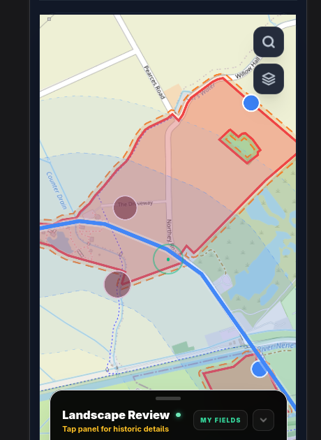

# RRRA engineered roads — slice 2 sign-off candidate

Date: 2026-07-26

Baseline: v4.12.2 plus Roman-road data-hygiene slice

Status: v4.12.5 corrective implementation and DS field-map verification
complete; the courtesy email remains before release

## Dataset evidence

| Check | Evidence |
|---|---|
| Source vintage | Digital Britannia v1.0 engineered Roman roads, downloaded 2026-07-26 |
| Raw source | 3,941,276 bytes; 3,572 observed features (published figure: 3,577) |
| Raw SHA-256 | `ff4caff0b4446554660b117304554b51e7e9b1420c262f3dbdf60c0f1454b9d2` |
| Projection | EPSG:27700 to EPSG:4326 with GDAL `ogr2ogr`, coordinates rounded to 5 decimal places |
| Projection pin | Fen Causeway fid 245 starts at `[-0.35572, 52.56636]`; test tolerance is 10 m |
| Built asset | 3,505 features; 1,417,865 bytes; one precached asset below the 3 MiB gate |
| Built SHA-256 | `d7577aaba43e11f63afa6c3e00bdf2a83e135be49a1330361479c7a2b2cbda37` |
| Geometry cleanup | 67 input features removed; all 67 had empty/zero-length geometry, so the 67 degenerate features are the complete subset counted by the 67 sub-20 m removals, not an additional total |
| IDs | 3,505 unique content-derived `rrra-` IDs; an idempotent rebuild is byte-identical |
| Classification | Every engineered-road feature is class A; the consumer emits certainty score 90 |
| Named checks | 27 features contain “Fen Causeway”; its closest segment is approximately 30 m from the pinned Flag Fen point. Four features are named “Ermine Street”, all RRRA class A |
| DS visual check | PASS — FieldGuide screenshot received 2026-07-26 showing the Roman-road alignment and corridor through the Flag Fen/Fengate scan area |
| Property schema | Exact v1.0 keys and value-type domains are pinned; `Segment Confidence` is pinned to `0`, `1`, `2`, `3`, `null` and is deliberately not interpreted |
| Shipped provenance | No Itiner-e-derived bytes remain in `public/roman-roads-gb.geojson`; `source: 'itinere'` remains accepted for historical cached records |

For the preceding hygiene slice, the legacy asset changed from 1,659 to 1,351
features: 308 features were removed. The reported 20 degenerate geometries
were a subset of those same 308 sub-20 m features, so they do not add another
20 to the removal count.

## Implementation evidence

- The existing `scripts/build-roman-roads.mjs` pipeline handles the RRRA input;
  unreprojected British National Grid coordinates fail WGS84 bounds validation.
- The emitted properties are limited to source, name, road reference and
  confidence class.
- `HISTORIC_CACHE_VERSION` is `HISTORIC-2026.07.26b`.
- The static-dataset and cache-policy contracts register the generation,
  measured byte size, input hash and service-worker invalidation owner.
- The PWA manifest contains exactly one `roman-roads-gb.geojson` precache entry.
- The same-name/same-source crossing suppression remains in place for RRRA
  segments; it was not retired without diagnostic evidence.
- NOTICE and Settings expose the RRRA attribution and permanent fee-charging
  constraint. Historical Itiner-e attribution is retained for cached records.
- The session-coverage fixture clock is pinned to one minute after its fixed
  session end time, removing its wall-clock expiry failure.

## v4.12.5 production correction

The v4.12.4 live check exposed a network-dependent source-policy regression.
When Overpass succeeded, FindSpot combined RRRA with OSM relation `7612846`
(`conjectural=yes`) and member way `497933068` (“Approximate location” and an
estimated Fen Causeway segment). Local validation had shown only the correct
RRRA alignment, so the supplied DS screenshot remains the ground-validated
reference.

The correction removes Roman-road requests from both Overpass scan queries and
defensively filters any OSM feature classified as a Roman road before it reaches
either scan coordinator. OSM historic trackways and holloways remain available.
A permanent regression fixture contains the exact relation and member-way tags
returned at Flag Fen and proves that only the non-Roman context routes survive
the production policy.

## Verification matrix

| Command | Result |
|---|---|
| `npm test` | PASS — 94 files; 919 passed; 1 intentional skip |
| `npm run test:worker:nix` | PASS — 10 passed |
| `npm run test:e2e:nix` | PASS — 52 passed |
| `npm run build` | PASS — PWA precache 53 entries / 5,036.41 KiB |
| `npm run check:release` | PASS — v4.12.5 release metadata ready |
| `git diff --check` | PASS |
| Type floor | PASS — 883, below the 891 ceiling |
| Explicit `any` ratchet | PASS — unchanged at 137 |

## DS field-map evidence

Original capture: `Screenshot From 2026-07-26 21-22-57.png`

Evidence SHA-256:
`9b04cdf5c99b596a2ffcc97c709d1b04b9c6b0a6dc7622ad0509405757cdda6b`

## External check before release sign-off

- Send the courtesy/licensing message recorded in
  `docs/rrra-digital-britannia-licensing.md`. This build environment had no
  connected email sender, so it has not been represented as sent.

The RRRA reply is not required to ship. If it documents `Segment Confidence`,
raise a follow-up ticket rather than changing this slice.
